# Dev notes

The thunderstore payload of mod data for Lethal Company is 182mb of JSON. (fucking massive)

This makes it slow to handle and is probably why r2modman is so laggy.
For LethalModder this doesn't couse lag but loading is slow and ram usage spikes to around 1.2gb.

This could be saved to a file and read incrementaly 
but it would most likely slow down LethalModder more than just keeping it in memory.
GC either way cuts it down to 700mb when idle.

### How this should work

```mermaid
flowchart TD;
    %% Node styles
    classDef startEnd fill:#494949,stroke:#FFFFFF,stroke-width:4px,stroke-dasharray: 5, 5;
    classDef process fill:#4A4A4A,stroke:#FFFFFF,stroke-width:3px;
    classDef decision fill:#3B3B3B,stroke:#FFFFFF,stroke-width:3px,stroke-dasharray: 2, 2;
    classDef data fill:#383838,stroke:#FFFFFF,stroke-width:2px;

    %% Nodes with icons
    A[Open LethalModder]:::startEnd
    B([Load data from Thunderstore]):::data
    C([Load local profiles]):::data
    D{Select profile or create new}:::decision
    E([Modify the selected profile]):::process
    F([Create a new profile]):::process
    G([Save profile changes]):::process
    H{Switch profiles?}:::decision
    I[Close LethalModder]:::startEnd
    J([Apply selected profile mods]):::process

    %% Edge connections between nodes
    A --> B;
    A --> C;
    B --> D;
    C --> D;
    D -- Select existing profile --> E;
    D -- Create new profile --> F;
    E --> G;
    F --> G;
    G --> H;
    H -- Yes --> D;
    H -- No --> J;
    J --> I;

```

This is mostly the same as r2modman but I can't think of a better way especcially in a TUI.